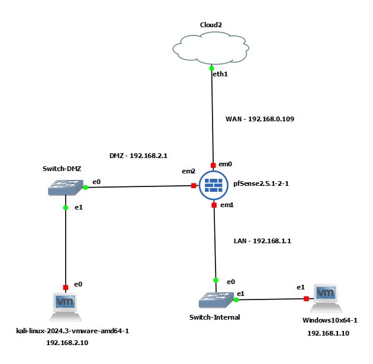

# Secure-IT-Infrastructure-GNS3
This project demonstrates the design and implementation of a secure IT infrastructure for a simulated e-commerce business environment.  ## Project Overview  The network was built in GNS3 using a three-zone architecture:  - WAN: Internet-facing network - LAN: Internal Windows client network - DMZ: Kali Linux Apache web server network

pfSense was used as the main firewall and router between the zones. Apache was deployed on Kali Linux as the public-facing web server.

## Topology

## IP Addressing

| Device | Interface | IP Address | Role |
|---|---|---|---|
| pfSense | WAN/em0 | 192.168.0.109 | WAN |
| pfSense | LAN/em1 | 192.168.1.1 | LAN Gateway |
| pfSense | DMZ/em2 | 192.168.2.1 | DMZ Gateway |
| Windows Client | e1 | 192.168.1.10 | Internal Client |
| Kali Linux | e0 | 192.168.2.10 | Apache Web Server |

## Security Features

- Three-zone network segmentation: WAN, LAN and DMZ
- pfSense firewall rules
- DMZ-to-LAN blocking to prevent lateral movement
- Apache web server hosted in the DMZ
- HTTPS enabled using a self-signed certificate
- UFW host-based firewall on Kali Linux
- Apache server banner suppression
- Connectivity and firewall testing evidence

## Tools Used

- GNS3
- pfSense
- Kali Linux
- Apache HTTP Server
- Windows 10 Client
- UFW
- OpenSSL

## Note

The full GNS3 VM is not included because it depends on local virtual machine images and host configuration. Instead, this repository contains the report, topology, configurations, commands and screenshots required to understand and recreate the lab.
